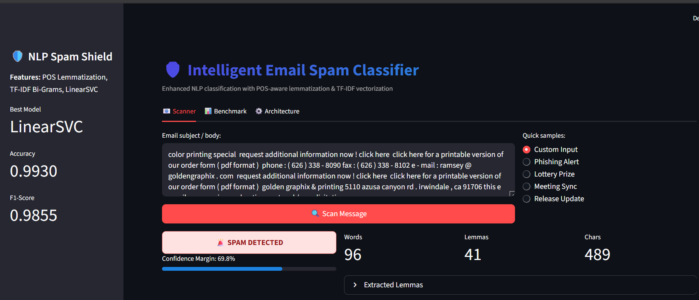
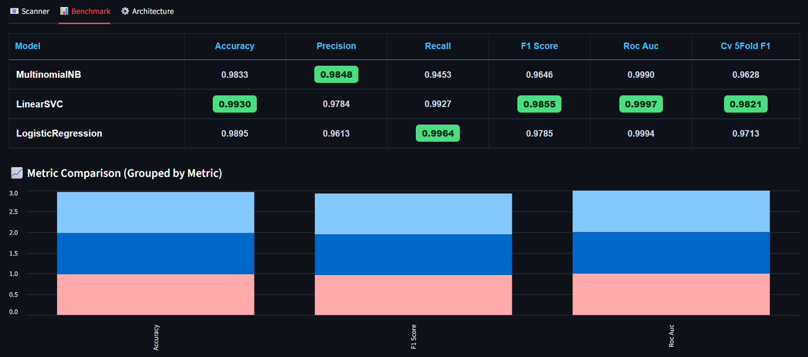
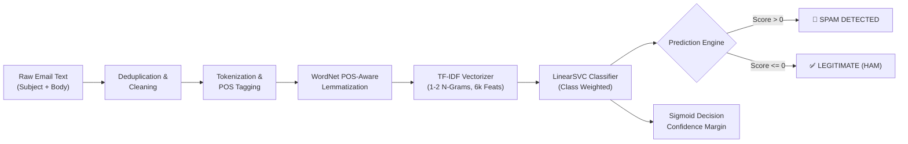

# 🛡️ Intelligent AI Email Spam Classifier with Enhanced NLP

[](https://python.org)
[](https://streamlit.io)
[](https://scikit-learn.org/)
[](https://www.nltk.org/)
[](./Source%20Code/model_metrics.json)
[](./Source%20Code/model_metrics.json)

An end-to-end Machine Learning and Natural Language Processing (NLP) system designed to detect and filter fraudulent, phishing, and spam emails with high precision. Powered by **POS-aware WordNet Lemmatization**, **Sublinear TF-IDF (Uni- & Bi-gram) Vectorization**, and an optimized **Linear Support Vector Classifier (LinearSVC)** paired with an interactive **Streamlit Dashboard**.

---

## 📸 Interactive Web Interface

### 1. Live Email Scanner & NLP Analyzer
Analyze custom messages or use curated phishing/lottery presets with real-time classification, confidence margins, and lemma breakdown.



### 2. Live Model Benchmark & Comparison
Examine real-time comparative metrics across models with highlighted top performers and metric charts.



---

## ✨ Key Features

- **🧠 Context-Aware NLP Preprocessing**:
  - Part-of-Speech (POS) tagged lemmatization via NLTK WordNet (retaining verb, noun, adjective, and adverb semantics).
  - Stopword filtering, punctuation removal, case normalization, and dataset deduplication.
- **⚡ High-Dimensional Feature Extraction**:
  - Sublinear TF-IDF feature scaling with **Uni-grams & Bi-grams** (`ngram_range=(1, 2)`).
  - Vocabulary capped at `max_features=6000` with minimum document frequency thresholds (`min_df=2`).
- **🏆 Multi-Model Competitive Benchmarking**:
  - **LinearSVC** (Best Performing Model with balanced class weighting)
  - **Multinomial Naive Bayes (`MultinomialNB`)**
  - **Regularized Logistic Regression (`LogisticRegression`)**
- **📈 Robust Validation**:
  - 5-Fold Stratified Cross-Validation on training splits.
  - Evaluation via Accuracy, Precision, Recall, F1-Score, and ROC-AUC.
- **🖥️ Production-Ready Streamlit UI**:
  - Tabbed interface (Scanner, Benchmark, Architecture).
  - Sigmoid-calibrated confidence margins from hyperplane decision boundaries.
  - Word, character, and lemma count statistics.

---

## 📊 Benchmark & Evaluation Results

All models were evaluated on an unseen 20% stratified test set and validated via **5-Fold Stratified Cross-Validation**.

| Model | Accuracy | Precision | Recall | F1-Score | ROC-AUC | 5-Fold CV F1 |
| :--- | :---: | :---: | :---: | :---: | :---: | :---: |
| 🥇 **LinearSVC** *(Selected)* | **99.30%** | **97.84%** | **99.27%** | **0.9855** | **0.9997** | **0.9821** |
| 🥈 **Logistic Regression** | 98.95% | 96.13% | **99.64%** | 0.9785 | 0.9994 | 0.9713 |
| 🥉 **Multinomial Naive Bayes** | 98.33% | **98.48%** | 94.53% | 0.9646 | 0.9990 | 0.9628 |

> **Highlight:** `LinearSVC` achieves the optimal balance between high precision (**97.84%**) and high recall (**99.27%**), minimizing false positives while catching nearly all spam emails.

---

## 🏗️ System Architecture & NLP Pipeline



---

## 📂 Repository Structure

```
├── Dataset/
│   └── emails.csv                           # Email dataset (5,728 samples: 4,360 Ham, 1,368 Spam)
├── Source Code/
│   ├── Python_Streamlit.py                  # Streamlit web application & UI logic
│   ├── train_enhanced_pipeline.py           # Automated training, evaluation & serialization script
│   ├── tfidf_vectorizer.pkl                 # Serialized TF-IDF feature vectorizer
│   ├── spam_classifier.pkl                  # Serialized best trained model (LinearSVC)
│   ├── model_metrics.json                   # Exported benchmark evaluation metrics
│   └── Email_Spam_Detection_Enhanced.ipynb  # Interactive Jupyter notebook for exploration
├── assets/
│   ├── streamlit_scanner_ui.png             # UI Screenshot: Scanner tab
│   └── model_benchmark_ui.png               # UI Screenshot: Benchmark comparison tab
└── README.md                                # Comprehensive documentation
```

---

## 💾 Dataset Details

- **Dataset File**: `Dataset/emails.csv`
- **Total Records**: 5,728 (5,695 unique samples after deduplication)
- **Class Distribution**:
  - **Ham (Legitimate)**: 4,360 samples (~76.1%)
  - **Spam**: 1,368 samples (~23.9%)
- **Attributes**:
  - `text`: Email subject line and raw body content.
  - `spam`: Binary ground truth target (`1` for Spam, `0` for Legitimate/Ham).

---

## 🚀 Getting Started

### 1. Prerequisites & Environment Setup

Ensure you have **Python 3.9+** installed. Clone this repository and navigate to the project directory:

```bash
git clone https://github.com/PATIL-BHARATH-SAI/-Intelligent-AI-Email-Spam-Classifier-with-Enhanced-NLP.git
cd -Intelligent-AI-Email-Spam-Classifier-with-Enhanced-NLP
```

### 2. Install Dependencies

Install all required Python packages:

```bash
pip install streamlit scikit-learn nltk pandas numpy matplotlib seaborn
```

*(Optional)* The application automatically verifies and downloads required NLTK corpora (`punkt`, `stopwords`, `wordnet`, `averaged_perceptron_tagger`) upon initialization.

---

### 3. Launch the Streamlit Web App

To run the interactive web interface, execute:

```bash
streamlit run "Source Code/Python_Streamlit.py"
```

Once launched, open your web browser at `http://localhost:8501`.

---

### 4. (Optional) Retrain & Export Pipeline

If you modify the training dataset or tweak preprocessing parameters, re-run the automated training pipeline to update the serialized `.pkl` models and `model_metrics.json`:

```bash
python "Source Code/train_enhanced_pipeline.py"
```

---

## 🔍 How It Works

1. **Text Normalization**: Strips `Subject:` prefixes, converts characters to lowercase, and extracts alphanumeric sequences.
2. **POS-Aware Lemmatization**: Tags parts of speech (verbs, nouns, adjectives, adverbs) to lemmatize words into their base forms accurately (e.g., *"running"* $\rightarrow$ *"run"*, *"better"* $\rightarrow$ *"good"*).
3. **TF-IDF Feature Representation**: Applies sublinear term frequency scaling across uni-grams and bi-grams to capture multi-word contextual flags (e.g., *"urgent click"*, *"verify account"*, *"free prize"*).
4. **Classification & Decision Scoring**: The `LinearSVC` evaluates the input against the learned separating hyperplane. Confidence is mapped using a calibrated sigmoid over the decision margin.

---

## 🛠️ Tech Stack

- **Language**: Python 3.9+
- **Machine Learning**: `scikit-learn` (LinearSVC, MultinomialNB, LogisticRegression)
- **Natural Language Processing**: `nltk` (WordNetLemmatizer, pos_tag, word_tokenize, stopwords)
- **Web App / UI**: `Streamlit`
- **Data Manipulation**: `pandas`, `numpy`
- **Visualization**: `matplotlib`, `seaborn`

---

## 📜 License

This project is licensed under the **MIT License**. Feel free to use, modify, and distribute for educational and commercial purposes.
